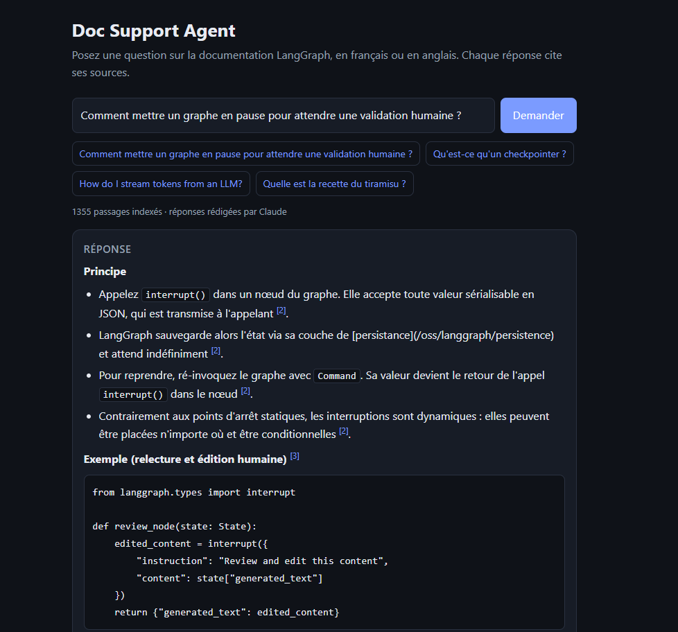

# Doc Support Agent — agent RAG avec citations

Agent IA qui répond à des questions techniques sur la documentation **LangGraph** (33 pages, ~1 350 passages indexés) **en citant ses sources**, et qui **refuse de répondre** quand la documentation ne contient pas l'information.

**Stack** : LangGraph · ChromaDB · FastAPI · Docker · Claude (optionnel) · pytest · GitHub Actions



*Question en français, documentation en anglais : l'agent retrouve la bonne section et cite ses sources (capture en mode sans clé API ; avec `ANTHROPIC_API_KEY`, Claude rédige la réponse).*

## Architecture

```
docs/**/*.mdx ─► ingest.py ─► ChromaDB (embeddings multilingues locaux, distance cosinus)
                                   │
question ─► FastAPI POST /ask ─► LangGraph
                                   ├─ retrieve  : top-k passages + filtre de pertinence
                                   ├─ generate  : réponse avec citations [1], [2] (Claude)
                                   └─ no_answer : aucun passage pertinent → pas d'hallucination
```

- **Ingestion** : nettoyage MDX (front-matter, balises JSX), découpage par titres en ignorant les blocs de code, puis fenêtres de 900 caractères / 150 de recouvrement. Le titre de page est ajouté au texte vectorisé.
- **Garde-fou anti-hallucination** : un passage dont la distance cosinus dépasse `MAX_DISTANCE` (0,50) est écarté ; sans passage restant, le nœud `no_answer` répond « je ne sais pas » sans appeler le LLM.
- **Citations** : chaque source renvoyée contient le fichier, la section et le lien vers la page officielle.
- **Sans clé API**, l'agent fonctionne en mode extractif (renvoie le passage le plus pertinent). Avec `ANTHROPIC_API_KEY` (dans l'environnement ou un fichier `.env`), Claude rédige une réponse concise dans la langue de la question, en citant les extraits [n] et en signalant ce que les extraits ne couvrent pas. Testé sur des questions FR et EN ; le hors-sujet est refusé avant tout appel au modèle (aucun coût).

## Évaluation

Jeu de test dans [`eval/dataset.json`](eval/dataset.json) : 22 questions avec la page attendue + 7 questions hors-sujet, **chacune en anglais et en français** (la documentation indexée est en anglais).

| Modèle d'embeddings | EN hit@4 | EN MRR | FR hit@4 | FR MRR | Poids |
|---|---|---|---|---|---|
| all-MiniLM-L6-v2 (anglais seul) | 91 % | 0,82 | 45 % | 0,42 | 0,1 Go |
| **paraphrase-multilingual-MiniLM-L12-v2 (retenu)** | 82 % | 0,79 | **77 %** | 0,74 | 0,2 Go |
| paraphrase-multilingual-mpnet-base-v2 | 82 % | 0,70 | 86 % | 0,69 | 1 Go |
| potion-multilingual-128M | 64 % | 0,55 | 45 % | 0,36 | 0,5 Go |

Choix : le MiniLM multilingue offre le meilleur compromis (5× plus léger que mpnet, meilleur MRR, image Docker raisonnable). Le modèle se change avec `EMBEDDING_MODEL`. Les questions françaises passent de 45 % à 77 % ; en contrepartie l'anglais perd 9 points, car ce modèle tronque les passages à 128 tokens.
Avec 22 questions, une question vaut 4,5 points : les écarts de quelques points ne sont pas significatifs.

Le seuil `MAX_DISTANCE` (0,50) vient d'un balayage (`python -m eval.run_eval --sweep`) : 100 % des questions hors-sujet rejetées en EN et FR. Des tests pytest échouent si la qualité régresse (CI).

Limites connues : pas de reranking ni de recherche hybride ; passages tronqués à 128 tokens par le modèle d'embeddings.

## Interface web

Une page de démonstration est servie sur `http://localhost:8000/` : champ de question, exemples cliquables (FR/EN/hors-sujet), réponse et sources avec liens vers la documentation officielle. L'API brute reste testable sur `/docs`.

## Lancer en local

```bash
pip install -r requirements.txt
uvicorn app.api:app --reload        # http://localhost:8000/docs
```

L'index se construit automatiquement au premier démarrage (ou `python -m app.ingest`).

## Lancer avec Docker

```bash
docker compose up --build
```

Pour utiliser Claude : copier `.env.example` en `.env` et renseigner `ANTHROPIC_API_KEY`.

## API

| Route | Rôle |
|---|---|
| `GET /health` | état + nombre de passages indexés |
| `POST /ingest` | ré-indexe le dossier `docs/` |
| `POST /ask` | `{"question": "..."}` → `{"answer", "sources": [{ref, source, section, url, distance}]}` |

```bash
curl -X POST localhost:8000/ask -H "Content-Type: application/json" \
     -d '{"question": "How do I pause a graph and wait for human approval?"}'
```

## Utiliser sa propre documentation

Déposer des `.md` / `.mdx` / `.txt` dans `docs/` puis `POST /ingest`. Adapter `eval/dataset.json` et relancer l'évaluation pour recalibrer `MAX_DISTANCE`.

## Tests

```bash
pytest        # 8 tests : ingestion, API, citations, questions en français, rejet hors-sujet, qualité du retrieval
```

## Licence

Code sous licence MIT (voir `LICENSE`). La documentation indexée dans `docs/` reste sous sa propre licence MIT (LangChain).

## Crédits

La documentation indexée provient de [langchain-ai/docs](https://github.com/langchain-ai/docs) (licence MIT, © 2025 LangChain) — voir `docs/LICENSE-langchain-docs.txt`.

## Pistes d'amélioration

- Embeddings multilingues, recherche hybride (BM25 + vecteurs) et reranking
- Streaming de la réponse et mémoire de conversation (checkpointer LangGraph)
- Évaluation de la qualité de génération (fidélité aux sources) avec un LLM juge
